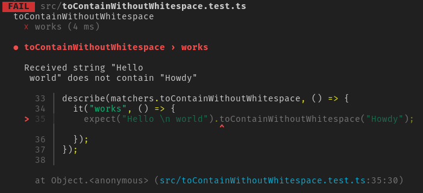
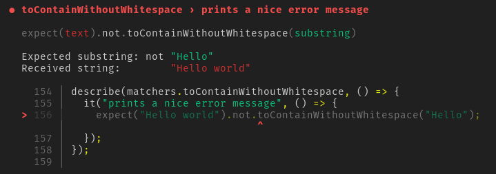
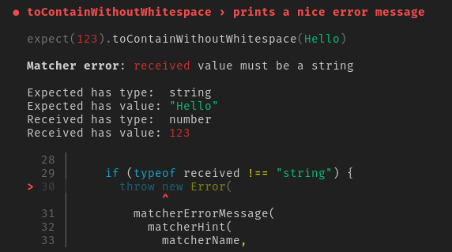

import { Button } from "../../src/lib/reusable-ui/Button";

# Going too far with Jest Custom Matchers in TypeScript

<BoxedText>


Dear future me, and other people who land here trying to copy-paste a
matcher.
[Here's the gist for you.](https://gist.github.com/hasparus/4ebaa17ec5d3d44607f522bcb1cda9fb)

</BoxedText>


I needed a Jest
[custom matcher](https://jestjs.io/docs/expect#expectextendmatchers) a few
days ago, and I couldn't find any article I could copy-paste it from.
[The docs](https://jestjs.io/docs/expect#expectextendmatchers) are okay, and
they even mention how to use custom matchers in TypeScript, but I think I
have some observations which are not included there.

Later down the post I write a lot of unnecessary and overly complex
typelevel code, so if you're a fan of this kind of stuff, bear with me (or
press the button below).

<Button
  as="a"
  href="#type-level-shenanigans"
  variant="primary"
  sx={{
    mt: 2,
    mb: 3,
    p: "0.25em 0.5em",
    bg: "muted",
    display: "block",
    width: "fit-content",
  }}
>
  Skip to TypeScript shenanigans
</Button>

## Por qué?

I wanted to assert that a long string contains a shorter one, disregarding
all whitespace and formatting. Something like this:

```ts
expect(longString).toContainWithoutWhitespace(shortString);
```

I could write the following

```ts
expect(stripWhitespace(longString)).toContain(stripWhitespace(shortString));
```

but then my tests wouldn't
[read like prose](https://idratherbewriting.com/blog/treat-code-like-code-and-prose-like-prose/)
(lol). I already have a few tests like this and I expect to have a lot more,
so I decided to invest in a custom matcher to make my tests more readable.

## Here's how we do this

In reality, I've stolen `toContain` implementation from Jest's repo and
adapted it a bit, but I'll go step by step from the ground up, because a
wall of copied code doesn't help to make a good blog post.

The least we need to do is:

1. Write the core logic for our assertion
2. Register our matcher with `expect.extend`
3. Merge declarations for our matcher into Jest global types

What would be nice to do:

1. Ensure the error messages are friendly and informative to get us started
   quickly when tests fail
2. Validating the input in case our types are disregarded
3. Derive the types from the implementation so we don't have to write things
   twice. (Mostly because I wanted to have some fun with TypeScript)

### The simplest implementation

The smallest thing we can implement looks about like this:

```tsx
const stripWhitespace = (s: string) => s.replace(/\s/g, "");

const matchers = {
  toContainWithoutWhitespace(
    // a matcher is a method, it has access to Jest context on `this`
    this: jest.MatcherContext,
    received: string,
    expected: string
  ) {
    return {
      pass: stripWhitespace(received).includes(stripWhitespace(expected)),
      message: () =>
        `Received string "${received}" does ${
          this.isNot ? "" : "not "
        }contain "${expected}".`,
    };
  },
};
```

We can import it in our tests and register it with `expect.extend`.

```tsx
expect.extend(matchers);
```

Tada! We can now use our matcher 🎉 There's a small problem though.
TypeScript doesn't know about it, so our tests are all red and fiery. Time
to merge our function merge into `jest.Matchers` type.

```tsx
// Hey TypeScript, let's go to global scope.
declare global {
  // Where `jest` namespace is already defined. Let's go inside it.
  namespace jest {
    // Remember the Matchers interface that was already defined here?
    interface Matchers<R> {
      // This interface contains one more method now! Cool, huh?
      toContainWithoutWhitespace(substring: string): R;
    }
  }
}
```

You can read more on
[merging interfaces](https://www.typescriptlang.org/docs/handbook/declaration-merging.html#merging-interfaces),
[merging namespaces](https://www.typescriptlang.org/docs/handbook/declaration-merging.html#merging-namespaces),
and
[global augmentation](https://www.typescriptlang.org/docs/handbook/declaration-merging.html#global-augmentation)
in TypeScript docs.

Let's see how our matcher works.

<figure>




<figcaption>
<details>
<summary>Expand text from the picture 👈</summary>


```
FAIL  src/toContainWithoutWhitespace.test.ts
  toContainWithoutWhitespace
    ✕ works (5 ms)

  ● toContainWithoutWhitespace › works

    Received string "Hello
     world" does not contain "Howdy"

      33 | describe(matchers.toContainWithoutWhitespace, () => {
      34 |   it("works", () => {
    > 35 |     expect("Hello \n world").toContainWithoutWhitespace("Howdy");
         |                              ^
      36 |   });
      37 | });
      38 |

      at Object.<anonymous> (src/toContainWithoutWhitespace.test.ts:35:30)
```

</details>
</figcaption>
</figure>


The output doesn't look bad, but our matcher is definitely less cool than
the built-ins.

### Minor Improvements

Let's improve the message formatting and add some color to it. We'll grab
some useful functions from
[_jest-matcher-utils_](https://jestjs.io/docs/expect#thisutils).

```tsx
import { printExpected, printReceived } from "jest-matcher-utils";
```

`printExpected` and `printReceived` color their arguments with green and red
respectively.

```tsx
import { getLabelPrinter } from "jest-matcher-utils";

const printLabel = getLabelPrinter(labelExpected, labelReceived);
```

`getLabelPrinter` measures its arguments and returns a function appending
spaces to align our output into neat columns.

```tsx
import {
  MatcherHintOptions,
  matcherHint
}
```

`matcherHint` gives us a string that should look like the failing line from
our test, including modifiers like `.not`.

It's best illustrated by an example.

```tsx
const matcherName = "toContainWithoutWhitespace";

const _1 = matcherHint(matcherName, "text", "substring");

// const _1 = "expect(text).toContainWithoutWhitespace(substring);"

const _2 = matcherHint(matcherName, "text", "substring", {
  isNot: true,
  promise: "resolves",
});

// const _2 = "expect(text).resolves.not.toContainWithoutWhitespace(substring);"
```

`isNot` and `promise` are slots for `this.isNot` <sup>_`boolean`_</sup> and
`this.promise` <sup>_`"resolves" | "rejects" | ""`_</sup> from Jest matcher
context.

We can also add a comment and customize colors of first and second arguments
(_"text"_ and _"substring"_ in our exmmple)

```tsx
import * as chalk from "chalk";

const _2 = matcherHint(matcherName, "text", "substring", {
  isNot: this.isNot,
  promise: this.promise,
  comment: "＼(｀0´)／",
  expectedColor: chalk.bgMagenta.bold,
  receivedColor: chalk.blue.italic.inverse,
});
```

We could go mad with it, but uhh... please don't?

<figure>


<figcaption>
<details>
  <summary>Expand text from the picture 👈</summary>


```
expect(text).not.toContainWithoutWhitespace(substring) // ＼(｀0´)／
```

</details>
</figcaption>
</figure>


Let's see how our matcher would look like with all of these:

```tsx
const matchers = {
  toContainWithoutWhitespace(
    this: jest.MatcherContext,
    received: string,
    expected: string
  ) {
    const pass = stripWhitespace(received).includes(
      stripWhitespace(expected)
    );

    const message = () => {
      const labelExpected = "Expected substring";
      const labelReceived = "Received string";

      const printLabel = getLabelPrinter(labelExpected, labelReceived);

      const matcherName = "toContainWithoutWhitespace";
      const isNot = this.isNot;
      const matcherHintOptions: MatcherHintOptions = {
        isNot,
        promise: this.promise,
      };

      const hint =
        matcherHint(matcherName, "text", "substring", matcherHintOptions) +
        "\n\n";

      return (
        hint +
        printLabel(labelExpected) +
        (isNot ? "not " : " ") +
        printExpected(expected) +
        "\n" +
        printLabel(labelReceived) +
        (isNot ? "    " : " ") +
        printReceived(received)
      );
    };

    return { message, pass };
  },
};
```

<figure>




<figcaption>
<details>
<summary>Expand to read the message. 👈</summary>


```
  ● toContainWithoutWhitespace › prints a nice error message

    expect(text).not.toContainWithoutWhitespace(substring)

    Expected substring: not "Hello"
    Received string:        "Hello world"

      110 | describe(matchers.toContainWithoutWhitespace, () => {
      111 |   it("prints a nice error message", () => {
    > 112 |     expect("Hello world").not.toContainWithoutWhitespace("Hello");
          |                               ^
      113 |   });
      114 | });
      115 |
```

</details>
</figcaption>
</figure>


Way nicer than before, innit?

### Runtime validation

When we call `expect.extend` our matcher is added to all expectations, even
the ones not on strings <small>(not for long!)</small>, so we need to
validate the input.

We'll grab some more utils from _jest-matcher-utils_ and use them to build

```tsx
import {
  EXPECTED_COLOR,
  RECEIVED_COLOR,
  matcherErrorMessage,
  printExpected,
  printReceived,
  printWithType,
} from "jest-matcher-utils";

const matchers = {
  toContainWithoutWhitespace(
    this: jest.MatcherContext,
    // We use `unknown` here, because we're not guaranteed to receive strings
    received: unknown,
    expected: unknown
  ) {
    const matcherName = "toContainWithoutWhitespace";
    const options: MatcherHintOptions = {
      isNot: this.isNot,
      promise: this.promise,
    };

    if (typeof received !== "string") {
      throw new Error(
        matcherErrorMessage(
          matcherHint(
            matcherName,
            String(received),
            String(expected),
            options
          ),
          `${RECEIVED_COLOR("received")} value must be a string`,
          printWithType("Expected", expected, printExpected) +
            "\n" +
            printWithType("Received", received, printReceived)
        )
      );
    }

    if (typeof expected !== "string") {
      throw new Error(
        matcherErrorMessage(
          matcherHint(matcherName, received, String(expected), options),
          `${EXPECTED_COLOR("expected")} value must be a string`,
          printWithType("Expected", expected, printExpected) +
            "\n" +
            printWithType("Received", received, printReceived)
        )
      );
    }

    // redacted for brevity
  },
};
```

<figure>




<figcaption>
<details>
<summary>Expand to read the message. 👈</summary>


```
  ● toContainWithoutWhitespace › prints a nice error message

    expect(123).toContainWithoutWhitespace(Hello)

    Matcher error: received value must be a string

    Expected has type:  string
    Expected has value: "Hello"
    Received has type:  number
    Received has value: 123

      28 |
      29 |     if (typeof received !== "string") {
    > 30 |       throw new Error(
         |             ^
      31 |         matcherErrorMessage(
      32 |           matcherHint(
      33 |             matcherName,
```

</details>
</figcaption>
</figure>


Sweet error message. We'll instantly know what went wrong and where.

Our matcher is now in its final form, and since it's destined to be
registered with `expect.extend` we can go one step further to minimize our
API surface and the number of lines users have to write. Instead of
exporting our matchers, we'll register them ourselves.

```tsx
const jestExpect = (global as any).expect;

if (jestExpect !== undefined) {
  jestExpect.extend(matchers);
} else {
  console.error("Couldn't find Jest's global expect.");
}
```

Now anybody can get `toContainWithoutWhitespace` just with a side-effect
import.

```tsx
import "./our-matchers";
```

## Type-level shenanigans

We have arrived to the fun stuff.

Remember that runtime validation few paragraphs above? Right now we could
use this after any `expect(actual)`, but our implementation throws for
anything that's not a string. This is an inconvenience.

Let's add a simple conditional type to fix it. In tests written in
TypeScript, we'll prevent from using our matcher if the argument passed to
`expect` is not a string.

Fortunately, `Matchers` interface provides us with _T_ parameter with the
type of value given to `expect`.

```tsx
declare global {
  namespace jest {
    interface Matchers<R, T = {}> {
      toContainWithoutWhitespace: T extends string
        ? (substring: string) => R
        : "Type-level Error: Received value must be string";
    }
  }
}
```

This way, we can always check that `toContainWithoutWhitespace` exists, but
we can call it only when the tested value (the _T_ we get from Jest's types)
is a string.

<BoxedText>


This typelevel `X extends Y ? A : B` is a
[conditional type](https://www.typescriptlang.org/docs/handbook/2/conditional-types.html).
You can read `extends` as _is assignable to_ and then it works like usual
[inline if](https://en.wikipedia.org/wiki/%3F:).

</BoxedText>


Our implementation uses `unknown` and validates its arguments so we're
covered from both sides.

Okay, but what if I have a _production codebase_, an a ton of custom
matchers — imagine a big number like ℵ<sub>0</sub> or 8?

## Going too far with types

( ͡° ͜ʖ ͡°)

Insted of writing signatures of our matchers to add them to `Matchers`
interface, we can compute them from the implementation!

```tsx
/// <reference types="@types/jest" />

const matchers = {
  toHaveWordsCount(
    this: jest.MatcherContext,
    sentence: string,
    wordsCount: number
  ) {
    // implementation redacted
  },
};
```

Okay, what information do we have here?

- The function name is important, obviously.
- We're not interested in `this: jest.MatcherContext`.
- `sentence` is passed to `expect`, and we want `toHaveWordsCount` to appear
  **only if** the sentence is a string.
- `wordsCount: number` will be the only argument of the function we're
  trying to derive.

So what do we need?

Certainly, we need something extract function arguments. — `Parameters` is a
built-in.

```ts
// type _Step1 = [sentence: string, wordsCount: number]
type _Step1 = Parameters<typeof matchers.toHaveWordsCount>;
```

We need something to get rid of that `sentence`. We could have more
arguments, so we're not interested in picking the second one, but in
skipping the first. A function which does it is usually called _tail_.

```ts
type Tail<T extends unknown[]> = T extends [infer _Head, ...infer Tail]
  ? Tail
  : never;

// type _Step2 = [wordsCount: number]
type _Step2 = Tail<_Step1>;
```

We can combine it into something like this.

```ts
// type _Step3 = { toHaveWordsCount: (wordsCount: number) => void; }
type _Step3 = {
  toHaveWordsCount: (
    ...args: Tail<Parameters<typeof matchers.toHaveWordsCount>>
  ) => void;
};
```

We'll have to
[map over](https://www.typescriptlang.org/docs/handbook/2/mapped-types.html)
`typeof matchers` instead of listing its properties one by one.

```ts
type OurMatchers = typeof matchers;

// type _Step4 = { toHaveWordsCount: (wordsCount: number) => void; }
type _Step4 = {
  [P in keyof OurMatchers]: (
    ...args: Tail<Parameters<OurMatchers[P]>>
  ) => void;
};
```

And turn it into a generic type parametrized by the type of our matchers
implementation.

```ts
type GetMatchersType<TMatchers> = {
  [P in keyof TMatchers]: (...args: Tail<Parameters<TMatchers[P]>>) => void;
};
```

Okay, this doesn't quite work yet — we've got an error.

> Type `TMatchers[P]` does not satisfy the constraint
> `(...args: any) => any`.

`Parameters` is defined like this:

```ts
type Parameters<T extends (...args: any) => any> = T extends (
  ...args: infer P
) => any
  ? P
  : never;
```

Noticed this generic constraint? We can't use `Parameters` on something that
isn't a function. Of course!

```ts
type AnyFunction = (...args: any) => any;

type GetMatchersType<TMatchers> = {
  // for each property in TMatchers
  [P in keyof TMatchers]: TMatchers[P] extends AnyFunction
    ? // if it's a function we transform it like we wanted
      (...args: Tail<Parameters<TMatchers[P]>>) => void
    : // if it's not a function, we have no beef with it — we pass it further
      TMatchers[P];
};
```

We're almost done. but do you remember that _R_ parameter `Matchers`
interface had? It holds the return type of the matcher. If I'm not wrong it
has something to do with Jest's `.resolves` and
[`.rejects`](https://jestjs.io/docs/tutorial-async#rejects) which turn the
result of matchers after them into a promise. For our use case, let's just
play nice and pass it along because all the builtin matchers do.

```ts
interface Matchers<R, T = {}>
  toBeDefined(): R;
  toBeFalsy(): R;
  toBeGreaterThan(expected: number | bigint): R;
  // ...redacted for brevity
}
```

See?

Here goes our final `GetMatchersType`.

```ts
type GetMatchersType<TMatchers, TResult> = {
  [P in keyof TMatchers]: TMatchers[P] extends AnyFunction
    ? (...args: Tail<Parameters<TMatchers[P]>>) => TResult
    : TMatchers[P];
};
```

The only thing left to do is ensuring that `toHaveWordsCount` appears only
if the value given to `expect` is a string.

```ts
type FirstParam<T extends AnyFunction> = Parameters<T>[0]

type OnlyMethodsWhereFirstArgIsOfType<
  TObject,
  TWantedFirstArg
> = {
    [P in keyof TObject]: TObject[P] extends AnyFunction
      ? TWantedFirstArg extends FirstParam<TObject[P]>
        ? TObject[P]
        : [`Type-level Error: this function is present only when received is:`, FirstParam<TObject[P]>]
      : TObject[P]
}
```

Let's try it out:

```ts
type OurMatchers = {
  toHaveWordsCount(sentence: string, wordsCount: number): void;
  toBeGreaterThan(actual: number | bigint, expected: number | bigint): void;
};

// type _Step6 = {
//   toHaveWordsCount: ["Type-level: this function is present only when received is:", string];
//   toBeGreaterThan: (actual: number | bigint, expected: number | bigint) => void;
// }
type _Step6 = OnlyMethodsWhereFirstArgIsOfType<OurMatchers, number>;
```

I went with that _fake type-level error_ because it carries more information
than `never`. There is a
[nice draft PR](https://github.com/microsoft/TypeScript/pull/40468) to
TypeScript repo implementing throw-types, but faking it with strings and
arrays is the best of what we have today.

Here's how it looks like in practice.

```ts
// 🔥 This expression is not callable.
//      Type '["Error: this function is present only when received is:", string]' has no call signatures.(2349)
_step6.toHaveWordsCount(2);
```

A bit messy, right? I'll argue it's still better than `never` carrying no
information.

Going back to Jest, we're ready to merge into `jest.Matchers` and use our
new matchers!

```ts
declare global {
  namespace jest {
    interface Matchers<R, T = {}>
      extends GetMatchersType<
        OnlyMethodsWhereFirstArgIsOfType<typeof matchers, T>,
        R
      > {}
  }
}

// ✅
expect("foo bar").toHaveWordsCount(2);

// 🔥 error as expected
expect(20).toHaveWordsCount(2);
```

Have a play with it in
[**TypeScript Playground**](https://tsplay.dev/mq8eYN).

Let me know if you liked this post. Thanks for reading!
