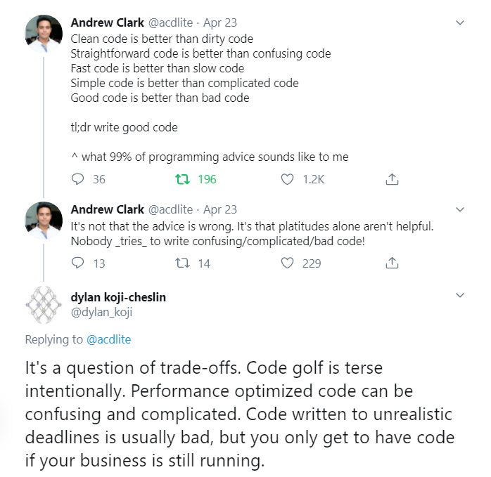

Disclaimer: This is a braindump / personal blogging.

The guy sitting next to me at the office has a wallpaper
saying "ALWAYS FUCKING DELIVER." This dude thinks I'm a good developer.
He sometimes asks me for some tips or opinions on code-related stuff.
Little does he know, I am a developer-disappointment.
When it comes to delivering, I ain't close to Jesus.
I'm actually closer to the [Polish Post].

[polish post]: https://www.reddit.com/r/poland/comments/9hf0oq/why_is_poczta_polska_so_bad/

I've started numerous side projects, which I didn't ship.
A startup idea I was working on with my close friend didn't get sherlocked,
which is hardly a good thing,
because we hadn't even started to ship when it was already too late.

<figure sx={{ '> p': { textAlign: 'center' } }}>

<figcaption>

Illustration by [Henrik Kniberg].
I've managed to build a bike or maybe even a motorbike once.\
The rest is a garage full of rolling chassis.

[Henrik Kniberg]: https://blog.crisp.se/2016/01/25/henrikkniberg/making-sense-of-mvp

</figcaption>

</figure>

I wanted to build a perfect product, with fantastic user experience, the newest
tech&nbsp;stack, and the&nbsp;cleanest code, while maintaining some degree of
personal life, passing exams, and completing a thesis.
The thesis included an app, which isn't&nbsp;production-ready (of course), 
but took more than five hundred hours of work of&nbsp;my partner and me combined.

**Obviously, I was an idiot.** I bit off more than I could chew.
I started drinking way too much coffee. My, once thick and bushy hair started falling off,
and I'm probably skinnier than I ever was. I don't remember how to prove a thing about
Van&nbsp;Emde&nbsp;Boas trees or Fibonacci heaps. I can probably do a simple amortized
analysis, nothing fancy, though.

On the flip side, I learned. I don't mean computer science. I got really good at
starting&nbsp;projects. I learned GraphQL, got a good grasp of the JavaScript ecosystem
with bundlers, React metaframeworks, and the like, but this isn't the most valuable
piece&nbsp;of knowledge I acquired.

I learned that **communication is key**. Unfortunately, in a hard way.

I learned that a good chunk of Medium software gurus and best practices
prophets spend more time marketing themselves than actually building software.
Any blogpost claiming that you should few [simple] rules to be a good developer is a hoax.
Instead (unfortunately?), we have to strive to understand the problem at hand, analyze
the&nbsp;choices we have, and put in honest work.

[simple]: https://asthasr.github.io/posts/danger-of-simplicity/

import { tradeoffsTweetsPng } from '../assets/tradeoffs-tweets.png'; 

<figure sx={{ img: { position: 'absolute', top: 0 } }}>

<figcaption sx={{ mt: 2 }}>
  You can't hide from trade-offs behind a bible of best practices.
</figcaption>

</figure>

How does my life look at the end of 2019?

I'm still failing. I've started adding a hamburger menu for this blog.
I wrote an SVG by hand, animated it and made it work without JavaScript.
But can you see it? Yeah, I didn't manage to finish the job and actually add it.
This is a failure, but a small one.
I don't need it until I add a "speaking" page with a list of my past meetup
talks and notes for them.

I've started a [side project] with two friends with whom I played roleplaying games.
Turns out they're kickass developers and we can learn a lot from each other.
I already learned what Event Storming is. We did two sessions of it and goddamn!
If only I knew it before! I'm feeling pretty confident that we'll ship the thing.
We've set the deadline for a prototype we can start dogfooding for the end of
January. 

The entire thing is (and is going to be) open source. Including [ADRs] with the
significant decisions we make. Our successes and failures will be visible in
the&nbsp;open, and we'll learn from them [in public].

I've got a few non-software side projects I could to write about, including
a&nbsp;huge&nbsp;one with [the girl I like], but this is the time to stop
writing this blog post and get to work.

[side project]: https://github.com/zagrajmy/
[ADRs]: https://adr.github.io/
[in public]: https://www.swyx.io/writing/learn-in-public/
[the girl I like]: https://twitter.com/aleksandrasays
