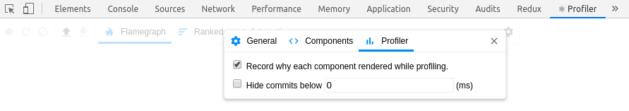
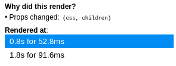
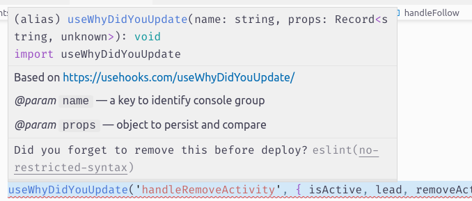
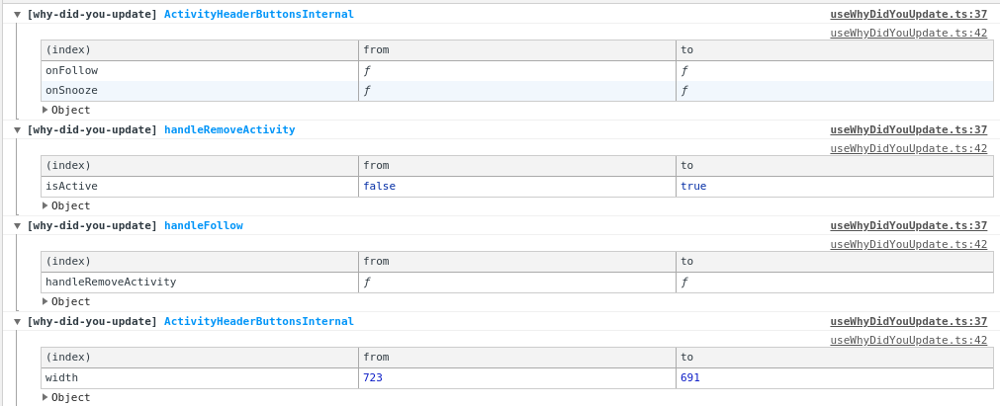

<Epistemic effort>
  This is a note for future me. A few code snippets grouped together.
</Epistemic>

I spent too long looking at React Profiler and tweaking rendering
performance today. Here are a few tricks I learned.

<TableOfContents />

**Huge disclaimer.** If you're new to React or programming in general, you
don't need to worry about performance. Read ["When to useMemo and
useCallback"][when-to-usememo] on Kent C. Dodds's blog.

[when-to-usememo]: https://kentcdodds.com/blog/usememo-and-usecallback

I have already worked for a year on the app I was optimizing today. A year
of&nbsp;my fulltime job! And I wasn't the only developer. It has both
keyframes and react‑spring animations, an API client codegenned from
Protobuf schema, and obeying Zawinski's law, it also reads and sends email.

It isn't too soon to think about performance anymore, because it affects
user experience on weaker machines. I just had to make this point.
Let's&nbsp;go&nbsp;to the main part.

## Finding the culprit 🔎

We throttled our CPU and found the part of the app which feels wrong. But
how do we find the slow components? How can we know what to optimize?

The official React Profiler will answer these questions.

<figure>




<figcaption>


Today! In your
[DevTools](https://chrome.google.com/webstore/detail/react-developer-tools/fmkadmapgofadopljbjfkapdkoienihi)!
Don't forget to mark this checkbox.

</figcaption>
</figure>


<figure>




<figcaption>


We can see which props changed.

</figcaption>
</figure>


It may be, however, laconic in its answers, when the hooks cause the update.
The issue requesting this is open since June 2019.

<small>


[_DevTools: Profiler: Show which hooks changed #16477_](https://github.com/facebook/react/issues/16477)

</small>


## The Tools of Deduction 🔬

So we know which component is causing trouble, but we need more details to
discover the cause. Wrapping everything in useMemo is a dumb idea. We call
ourselves engineers; let's pretend to be serious.

We download the results of our profiling, call them _"before.json"_ or
something like that, and snap a few screenshots for convenience. We'll need
them for comparison later, to make sure our changes are truly improvements.

### Monkey patching React 🐒

`@welldone-software/why-did-you-render` monkey patches React to detect
avoidable re-renders. Tools for debugging are the only good use case for
monkey patching.

I added this _beautiful_ piece of code to my entry point.

```tsx
if (process.env.NODE_ENV === "development") {
  document.title += " 🌴";

  const DEBUG_PERF = false;
  if (DEBUG_PERF) {
    // @ts-ignore for CI; why-did-you-render is in dev deps
    type WhyDidYouRender = typeof import("@welldone-software/why-did-you-render").default;
    // eslint-disable-next-line global-require, import/no-extraneous-dependencies
    const whyDidYouRender = require("@welldone-software/why-did-you-render") as WhyDidYouRender;

    whyDidYouRender(React, {
      trackAllPureComponents: true,
      collapseGroups: true,
      trackExtraHooks: [
        [
          // eslint-disable-next-line global-require
          require("./data/store")
            .__internal_import_me_only_for_debugging__store,
          "useSelectors",
        ],
      ],
    });
  }
}
```

Honestly, it didn't help me that much because I already profiled the app and
had a fairly good idea what's wrong. I just didn't know the exact reason.

### useWhyDidYouUpdate 🎣

Based on a recipe I found at
[usehooks.com](https://usehooks.com/useWhyDidYouUpdate), I've added a new
hook to my codebase. Sprinkled it with some TypeScript, changed
`console.log` for `console.group` and `console.table`, et voilà!

```tsx
/* eslint-disable no-console */
import { useRef, useEffect } from "react";

/**
 * Based on https://usehooks.com/useWhyDidYouUpdate/
 *
 * @param name a key to identify console group
 * @param props object to persist and compare
 */
export function useWhyDidYouUpdate(
  name: string,
  props: Record<string, unknown>
) {
  const previousProps = useRef<Record<string, unknown>>();

  useEffect(() => {
    const { current } = previousProps;
    if (current) {
      const allKeys = Object.keys({ ...current, ...props });
      const changesObj: Record<string, unknown> = {};
      allKeys.forEach((key) => {
        if (current[key] !== props[key]) {
          changesObj[key] = {
            from: current[key],
            to: props[key],
          };
        }
      });

      console.group(
        `%c[why-did-you-update] %c${name}`,
        "font-weight: bold;",
        "color: dodgerblue; font-weight: bold;"
      );
      if (Object.keys(changesObj).length) {
        console.table(changesObj);
      } else {
        console.log("Something else changed.");
      }
      console.groupEnd();
    }

    previousProps.current = props;
  });
}
```

I added it to [`no-restricted-syntax`][restricted] ESLint rule, to make sure
I don't deploy it staging by accident.

[restricted]: https://eslint.org/docs/rules/no-restricted-syntax



And here's how it looks like in browser devtools.



That's all! How do you investigate performance concerns in your apps?
Did&nbsp;I miss something? Feel free to reach out and let me know!
