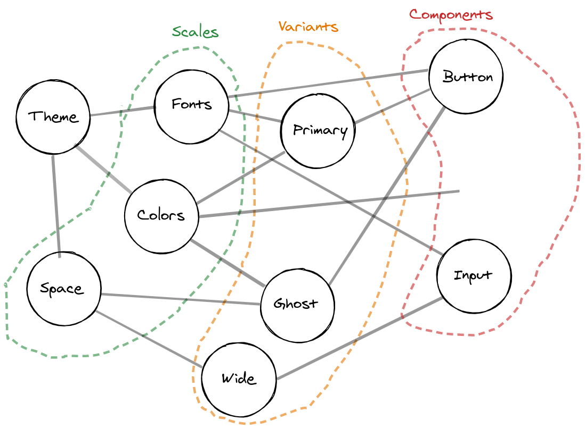
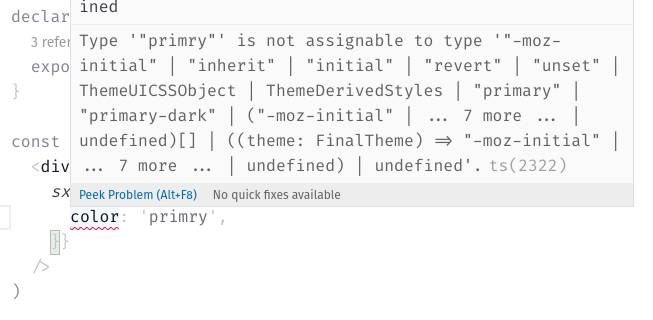

**Dan Questions**:

- How will you deliver the idea to the audience?

  - I'll tell a proper story. It has a hero and a villain.

- What is the one thing that you want people to take away from your talk?

  - Don't be afraid to say "Domain Specific Language" -- you probably used a
    lot of them.

- Why are you giving the talk? What is the emotional core? What do you
  believe in?

  - Sometimes you need to build the right tool for the job.

**Outline**:

- Introduce the hero and the villain.
- The villain destroys almost all colors in the world.
- Enter constraint-based design.
- We want to make illegal states unrepresentable.
- Emotion's CSS objects instead of CSS strings.
  - We can work with this.
- Enter `sx` prop. We're not in CSS-land anymore.
- Let's make its types stricter.
  - We preserve runtime behavior. It's useful for prototyping, but you don't
    want to merge arbitrary values to the main branch.

---

**Disclaimer:** The public API of `theme-ui` presented in code snippets
doesn't reflect current production. It's taken from a WIP open pull request.

## The hero and the villain

Every good story needs a hero, and a villain. The heroes of this one are
TypeScript, and CSS-in-JS. The villain here, is a hyperbolized version of a
designer I may have happened to work with. Let's name him... Sergey.

A typical UI/UX designer. Pretty serious guy, although he enjoys his
fashionable streetwear. Thick Russian accent.

[He looks more or less like this.](https://ilarge.lisimg.com/image/7159931/850full.jpg)

Sergey was responsible for the look and feel of the product we were
building, so when he told me

> "Piotr. There is no 'hotpink' and no 'lightblue'. There are only four base
> colors: _primary_, _background_, _text_ and _accent_. Each of them has one
> lighter and one darker shade."

I knew we were going to partake in constraint-based design. Sergey declared
similar things about spacing between components and typography, so...

if I use padding of six pixels while implementing the UI, Sergey will know.
He has a pixel-perfect vision! He will call me on Slack, and tell me "Piotr,
this is entirely messed up.", sometimes with words taken straight of your
last Counter Strike game.

As many of you, I am a fan of designing with types, and making illegal
states unrepresentable.

I want to avoid making Sergey angry, but CSS barely helps me. Okay, I can
use CSS variables, which are still not supported in Internet Explorer, but
it doesn't forbid me from using arbitrary values like "hotpink" or "6
pixels". TypeScript, however, is really good at this kind of stuff.

This leads us to the topic of our talk. CSS is a domain specific language
for styling, but not for my app on brand and according to Sergey's designs!

Fortunately, I don't really write CSS syntax anymore, I use object literals
in TypeScript.

```tsx
/** @jsx jsx */
import { jsx } from "@emotion/core";

import { breakpoints } from "./theme";

const PrimaryBox = () => {
  return (
    <div
      css={{
        width: "100px",
        height: "100px",
        backgroundColor: "#00f",
        [breakpoints.tablet]: {
          width: "200px",
          height: "200px",
        },
      }}
    />
  );
};
```

We can treat these object literals as an embedded domain specific language
for styling. An embedded DSL is a subset of a general purpose language we
use to solve problems from one specific domain. React is an embedded DSL in
JavaScript and TypeScript, designed for building interactive apps,
describing their interfaces and state in a declarative manner.

Enter Theme UI, which looks more or less like these 3 potatoes.

Theme UI builds up on top of Emotion and allows us to use our design tokens
as first class citizens.



```tsx
/** @jsx jsx */
import { jsx } from "theme-ui";

const BlueBox = () => {
  return (
    <div
      sx={{
        size: ["small", "medium"],
        bg: "primary",
      }}
    />
  );
};
```

Notice that this prop is no longer called `css`, and the responsive tuple
syntax instead of media query.
[Toto, I've a feeling we're not in CSS-land anymore.](https://youtu.be/vQLNS3HWfCM)

We're almost there. However, Theme UI doesn't forbid you from using
arbitrary values to allow prototyping.

```tsx
/** @jsx jsx */
import { jsx } from 'theme-ui'

const BlueBox = () => {
  return (
    <div
      sx={{
        bg: 'primry' // typo
        size: [
          '100px', // arbitrary value
          '1234p' // arbitrary value typo
        ],
      }}
	/>
  )
}
```

Let's see how can we change its types to implement "design tokens only"
mode.

<small>


_From this point onwards, we are not talking about current production Theme
UI._
_[See PR theme-ui#1090](https://github.com/system-ui/theme-ui/pull/1090)._

</small>


So how can we tell a library about a type we defined in our repository? How
can we inject it?

We do it with module augmentation

```ts
declare module "theme-ui" {}
```

and declaration merging

```ts
const myTheme = makeTheme({
  colors: {
    primary: "red",
    "primary-dark": "darkred",
  },
});
type MyTheme = typeof myTheme;

declare module "theme-ui" {
  export interface UserTheme extends MyTheme {}
}
```

But what is this weird UserTheme? It's nothing! Yet...

Let's add it to _@theme-ui/css_ in _src/types.ts_.

```ts
/**
 * Can be augmented by users to inject their exact theme into Theme UI types.
 */
export interface UserTheme {}
```

Then, we need to extract the types of keys of our color scale (`primary` and
`primary-dark`).

```ts
export interface FinalTheme extends Assign<Theme, UserTheme> {}

type Defined<T> = Exclude<T, undefined>;

type Color = keyof Defined<FinalTheme["colors"]> | CSS.Globals;
```

where `Assign` is a type-level sibling of `Object.assign`, imported from
[_utility-types_](https://github.com/piotrwitek/utility-types) or defined as
so

```ts
export type Assign<T, U> = {
  [P in keyof (T & U)]: P extends keyof U
    ? U[P]
    : P extends keyof T
    ? T[P]
    : never;
};
```

and add them to `OverwriteCSSProperties` interface.

```ts
interface OverwriteCSSProperties {
  // other properties redacted for brevity

  /**
   * The **`z-index`** CSS property sets the z-order of a positioned element and its descendants or flex items. Overlapping elements with a larger z-index cover those with a smaller one.
   *
   * **Initial value**: `auto`
   *
   * | Chrome | Firefox | Safari |  Edge  |  IE   |
   * | :----: | :-----: | :----: | :----: | :---: |
   * | **1**  |  **1**  | **1**  | **12** | **4** |
   *
   * @see https://developer.mozilla.org/docs/Web/CSS/z-index
   */
  zIndex?: CSS.ZIndexProperty | string;

  // here we go
  color?: Color;
  backgroundColor?: Color;
  borderColor?: Color;
  caretColor?: Color;
}
```

and our `color` values are typechecked 🎉



## Ending

I'm no longer a pain in the ass for Sergey, and my styles are typesafe.

---

The last example in my live [demo](https://youtu.be/-0smYzH1m3s?t=995)
obviously went wrong 😂
